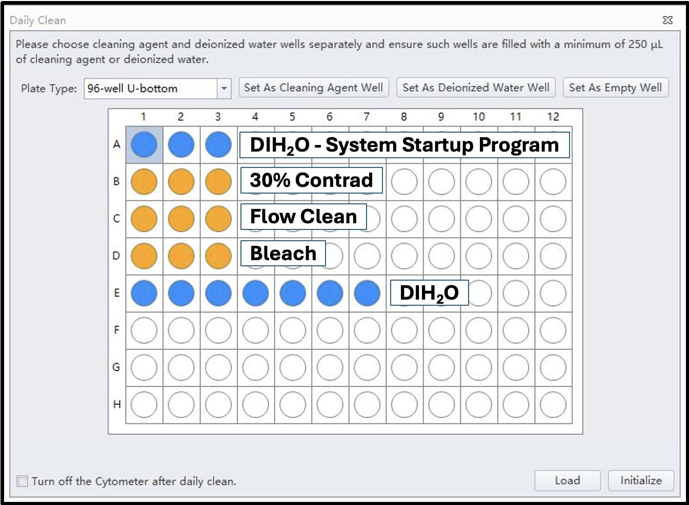

## Purpose

This document provideds step-by-step instructions for performing daily cleaning and QC of CytoFLEX S and LX.

------------------------------------------------------------------------

## Scope

This SOP is intended for anyone responsible for performing daily QC on CytoFLEX

------------------------------------------------------------------------

## Materials and Equipment

- Flow Clean
- Bleach
- 30% Contrad
- DI H2O
- Standard round-bottom 96-well plates
- Pipettes + Tips

::: callout-note
- All cleaning solutions should be warmed to 37C in a water bath.
- Each Instrument should have its own cleaning plate which can be re-used throught the week. Label new cleaning plates so they don't get thrown away.
:::

------------------------------------------------------------------------

## Procedure

### 1. Daily Cleaning

#### 1. Change Fluidics

1.  Switch cytometer to Standby Mode
2.  Empty waste tanks
3.  Refill sheath tanks

#### 2. Switch all instruments to Plate Mode

#### 3. Run System Startup Program

1.  Fill 3 wells of the cleaning plate with DI H20
2.  Cytometer tab -\> System Startup Program
3.  Select wells in the plate layout
4.  Start

{fig-align="left" width="436"}

#### 4. Daily Clean with sequential warm cleaning solutions

1.  Fill 3 wells of the cleaning plate with DI H20
2.  Cytometer tab -\> System Startup Program
3.  Select wells in the plate layout
4.  Load -\> Initialize -\> Start

#### 5. Daily Clean in Tube Mode

1.  Switch cytometer to Tube Mode
2.  Fill a 5mL FACS tube with 2 mL of warm 30% Contrad
3.  Run Daily Clean for 5 minutes with Contrad
4.  When prompted to run DI water, insert a tube with 2mL of Flow Clean
5.  Repeat Daily Clean cycle with bleach, followed by DI water

### 2. Daily QC

1.  Vortex the bottle and add 5 drops of CytoFLEX Ready to use Daily QC Fluorospheres to a 5 mL FACS tube
2.  QC/Standardization
3.  Select correct lot \# from the list
4.  Start
5.  Run a 1-2 minute daily clean to flush out beads

::: callout-note
For CytoFlex LX equipped with an IR laser, run IR Ready to Use Daily IR QC Fluorospheres (red label) first.
:::

## Troubleshooting QC Failures

| Problem | Likely cause | Resolution |
|---------|--------------|------------|
|         |              |            |
|         |              |            |

------------------------------------------------------------------------